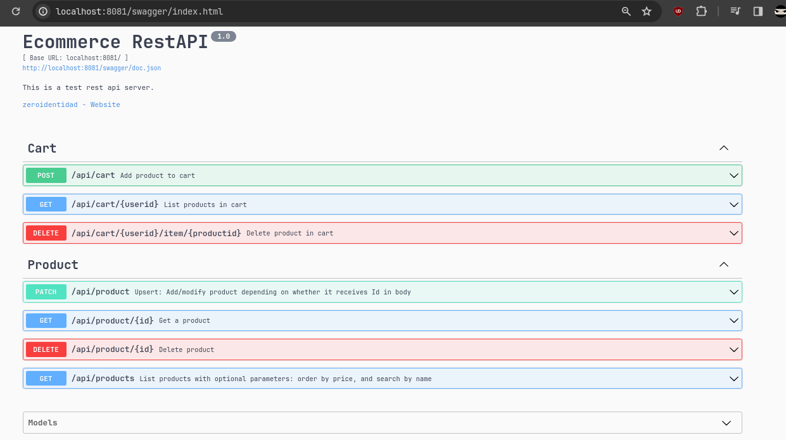

# Technical Test: Backend Golang

## Introduction 

This repo contains the codebase for an ecommerce Rest API that supply the requirements defined for the technical test.

**Source structure:**

```
cmd/
├─ server/
│  ├─ main.go
internal/
├─ db/
│  ├─ database.go
│  ├─ db_carts.go
│  ├─ db_products.go
│  ├─ migrate.go
├─ ecommerce/
│  ├─ cart.go
│  ├─ product.go
│  ├─ service_errors.go
│  ├─ service_store.go
├─ transport/
│  ├─ http/
│  │  ├─ handlers_cart.go
│  │  ├─ handlers_product.go
│  │  ├─ http_service.go
│  │  ├─ main.go
│  │  ├─ middleware.go
migrations/
├─ 000001_create_products_table.down.sql
├─ 000001_create_products_table.up.sql
├─ 000002_create_carts_table.down.sql
├─ 000002_create_carts_table.up.sql
postman/
├─ tests-ecom-api.postman.json
vendor/
├─ modules.txt
├─ ...*
.air.conf
air.sh
go.mod
go.sum
README.md
serve.sh
```

**Software tools usage:**

- Go version **1.22** ```go.mod```
- PostgreSQL **12** free remote instance
- Swagger CLI and http-swagger **v2**
- Air live reload ```.air.conf``` ```air.sh```

All software was used under a Linux OS distro

## Usage 

No get dependencies necessary with ```vendor``` included if using same version for local execution. In case of different go sdk version make downgrade to appropriate go module version and recreate vendoring deps with ```go mod tidy && go mod vendor```.

### How to execute

At root directory:

- **Option 1:** Without build, run ```go run ./cmd/server``` or simply use **.sh** script ```./serve.sh```

- **Option 2:** With build, run ```go build -o ./serveapi ./cmd/server```, then run ```./serveapi```

- **Option 3:** With live reload is necessary install [Air](https://github.com/cosmtrek/air) cli, and run ```./air.sh```

Example:


Having used any of the 3 options on how to run the service binary. The base access URL will be at: http://localhost:8081

## Endpoints documentation

### Swagger

With the service binary running, the documentation auto-generated by the Swagger cli will be available at the url: http://localhost:8081/swagger/



### Postman

An exported postman collection is available in the ```postman/``` directory to test endpoints in this way.


## Tutorial

Explanation and demonstration video: https://youtu.be/nvHW8-JyAzY

Not listed on Youtube only by link available in this repo.